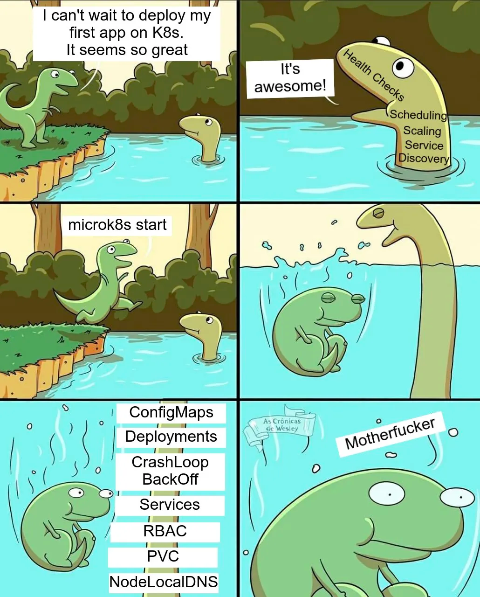

# Go, SQL and sqlc
Krzysztof Dryś
2023-04-13
<!-- theme: gaia -->
<style>
img[alt~="center"] {
  display: block;
  margin: 0 auto;
}
</style>
---
# Background

---




---


This a cover of book from 2008, a little before I started. You can still buy it on Amazon!

--- 


You’ll learn advanced skills [...] how to work with XML, how to use the Report Designer to create reports, how to use the ReportViewer control to display reports in both Windows and web applications, **how and why to use LINQ instead of SQL to query a database**, and how to use the Entity Framework in combination with LINQ so you can work with objects and **let the framework handle the database operations**.

---

Even though I was writing apps which talked a lot with DBs, I never wrote a single line of SQL.

In fact, I thought this is the only reasonable option.


---


```c#
[HttpPost]
[ValidateAntiForgeryToken]
public ActionResult Delete(int id)
{
    try
    {
        Student student = db.Students.Find(id);
        db.Students.Remove(student);
        db.SaveChanges();
    }
    catch (DataException/* dex */)
    {
        //Log the error (uncomment dex variable name and add a line here to write a log.
        return RedirectToAction("Delete", new { id = id, saveChangesError = true });
    }
    return RedirectToAction("Index");
}
```

---

```c#
var data = from student in db.Students
           group student by student.EnrollmentDate into dateGroup
           select new EnrollmentDateGroup()
           {
               EnrollmentDate = dateGroup.Key,
               StudentCount = dateGroup.Count()
           };
```           


---

Then I moved to Go and I started writing SQL by hand (again). 


---

Two Go proverbs, which show how Go is different from Java or .Net and why it took so much time for Go community to create ORMs:

> Clear is better than clever.

> Reflection is never clear.

Proverbs from Rob Pike's talk at [Gopherfest SV 2015](https://www.youtube.com/watch?v=PAAkCSZUG1c).


---

# Demo

---

---

# A few other things you can do with sqlc

- overwrite type for a column,
- use non-standard PostgreSQL driver,
- prepare queries,
- use transactions.
- use it with PostgreSQL, MySQL and SQLite.

---

# Random thoughts

---

# Benefits of NOT using ORM

- It's easier to debug and optimise your queries,
- Less dependencies,
- You can use all (most) features of your RDS,
- You can stop pretending that you will ever change RDS from MySQL to PostgreSQL.

